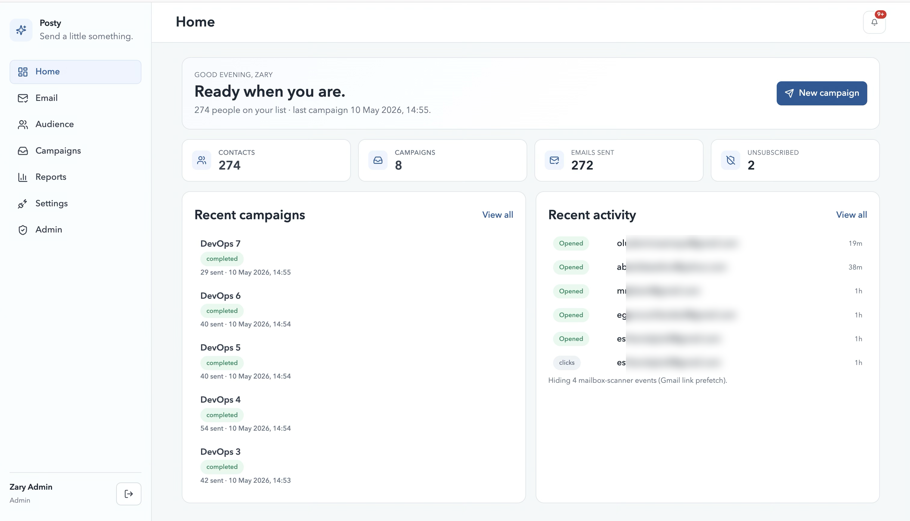

<p align="left">
  
</p>

> Send a little something.

A self-hosted email campaign tool. React + Vite frontend, Express + Prisma/Postgres
backend, Brevo for transactional sends and click tracking.



## Try it without installing

A public demo lives at **demo.posty.dev** (hosted separately; visit the link
to confirm it's up). Sandboxed: every send is dry-run, the database resets
every hour. To host your own demo, see [`docs/DEMO.md`](docs/DEMO.md).

## One-click deploy

| Platform | |
| --- | --- |
| Render | [](https://render.com/deploy?repo=https://github.com/helloSanmi/posty-mail) |
| Railway | [](https://railway.app/new/template?template=https://github.com/helloSanmi/posty-mail) |
| Coolify | See the [self-host guide](https://coolify.io/docs/applications/git#deploy-from-a-repository). Point at this repo, set the env vars below. |

After deploying, add a Postgres add-on (each platform offers one) and set
`DATABASE_URL`, `JWT_SECRET`, `BREVO_API_KEY`, and `PUBLIC_BASE_URL`. The
first user to sign up becomes admin.

---

## Why use Posty instead of Brevo's own UI

- **No vendor branding on the free plan.** Posty sends through Brevo's
  transactional API, so your emails go out unbranded even on Brevo's free
  tier (300 emails/day). Brevo's own Campaigns UI appends a *"Sent with
  Brevo"* footer until you upgrade to a paid plan.
- **You own your data.** Contacts, groups, send history, opens, clicks,
  unsubscribes. All stored in your own Postgres. Nothing locked behind
  Brevo's dashboard.
- **Your domain on the unsubscribe link.** Self-hosted `/unsubscribe`
  handler means recipients see `unsubscribe.yourdomain.com`, not Brevo's
  click-tracker domain.
- **Real engagement counts.** Click events from Gmail's link-prefetch
  scanner are detected and filtered, so your open/click numbers track real
  humans instead of mailbox-provider bots.
- **MIT licensed, no SaaS subscription.** Bring your own Brevo API key,
  run it on your own machine or VPS, share with your team.

> **Brevo's free plan is shared across transactional and marketing sends.**
> If you're using Brevo for both password-reset emails *and* Posty
> campaigns, both count against the same 300/day bucket. For larger lists,
> upgrade Brevo (you still don't need a paid plan for the branding-removal
> feature. Posty handles that side regardless).

---

## Quick start (local dev)

```bash
# 1. Postgres (docker)
npm run docker:db

# 2. Schema
npm run db:migrate

# 3. Env
cp .env.example .env
# fill in JWT_SECRET, BREVO_API_KEY, BREVO_SENDER_EMAIL at minimum

# 4. Run frontend + backend together
npm run dev
```

Frontend: http://localhost:5173 · Backend: http://localhost:4010

The first user to sign up becomes admin. After that, `ALLOW_OPEN_SIGNUP=false`
locks signup down so only admins can create new accounts.

---

## Environment variables

All listed in `.env.example` with inline notes. The ones that matter most:

| Var | Purpose |
| --- | --- |
| `DATABASE_URL` | Postgres connection. |
| `PUBLIC_BASE_URL` | Public URL the backend is reachable at. **Required for any email with embedded images**. See "Why the logo is broken" below. |
| `JWT_SECRET` | Signs auth tokens. 32+ random chars in production. |
| `BREVO_API_KEY` | Brevo transactional key. Without it, sends are dry-runs (logged, not delivered). |
| `BREVO_SENDER_EMAIL` / `BREVO_SENDER_NAME` | "From" identity. The email must be a verified sender in Brevo. |
| `BREVO_WEBHOOK_TOKEN` *or* `BREVO_WEBHOOK_SECRET` | Verifies incoming Brevo webhooks. One is required in production. |
| `CORS_ORIGIN` | Extra origins to allow. `PUBLIC_BASE_URL` is auto-allowed; in dev `localhost:5173` is too. Only set this when you need *additional* origins. |
| `ALLOW_OPEN_SIGNUP` | `false` (default) → only first user signs up freely; rest are admin-created. |
| `ALLOW_PASSWORD_RESET` | `false` disables the public reset endpoint; admins reset via the user modal. |

---

## Why the logo is broken in test emails

If you upload a logo and send a test, the image will load locally (in the
preview iframe) but show as broken in Gmail/Outlook. Cause: by default
`PUBLIC_BASE_URL` is `http://localhost:4010`, which Gmail's image proxy can't
reach. Embedded `` URLs need to resolve from the open internet.

The app catches this and shows an error toast after a test send if any image
URL is unreachable, but the fix is one-time setup:

### Option A: Cloudflare Tunnel (recommended if you own a domain on Cloudflare)

Stable subdomain, free, no expiry, no warning interstitials.

```bash
# 1. Install
brew install cloudflared                # macOS
# or grab the deb/rpm from github.com/cloudflare/cloudflared

# 2. Authenticate (opens browser)
cloudflared tunnel login

# 3. Create the tunnel
cloudflared tunnel create campaign-dev
# → outputs a UUID and writes ~/.cloudflared/<UUID>.json

# 4. Map a hostname (auto-creates the CNAME in Cloudflare DNS)
cloudflared tunnel route dns campaign-dev campaign.yourdomain.com
```

Create `~/.cloudflared/config.yml`:

```yaml
tunnel: campaign-dev
credentials-file: /Users/<you>/.cloudflared/<UUID>.json

ingress:
  - hostname: campaign.yourdomain.com
    service: http://localhost:4010
  - service: http_status:404
```

Run it (leave it running, or `sudo cloudflared service install` to daemonize):

```bash
cloudflared tunnel run campaign-dev
```

Point the app at it:

```env
PUBLIC_BASE_URL=https://campaign.yourdomain.com
```

Restart backend. CORS auto-includes the new public URL. No other config to
touch.

### Option B: ngrok (quick, ephemeral)

```bash
ngrok http 4010
# → copy the https://*.ngrok.app URL into PUBLIC_BASE_URL, restart backend
```

Free-tier URL changes on every restart and shows a browser warning page.
Fine for a one-off test, painful for ongoing dev.

### After changing `PUBLIC_BASE_URL`

Existing assets in the DB still hold the old URL (e.g., `http://localhost:4010/...`).
Either:

- Re-upload the logo via the LogoPicker, or
- Run the bulk-update SQL:
  ```sql
  UPDATE "Asset"
  SET url = REPLACE(url, 'http://localhost:4010', 'https://campaign.yourdomain.com');
  ```
  Then re-save any template that embeds the image so the `` updates.

---

## Persistence model

Everything except authentication state lives in Postgres:

- `Contact`, `Audience`, `Segment`. Your people and their grouping
- `Template`, `Asset`. Emails and their assets
- `Draft`, `Campaign`, `CampaignSend`. Campaign builder, scheduled/sent campaigns,
  per-recipient delivery rows
- `Event`, `Unsubscribe`. Brevo webhooks and list-hygiene
- `User`, audit-log entries, `Setting`

In `localStorage` (browser-only):

- `campaign-suite-token`. The JWT. Has to be client-side; it's the credential
  the browser sends back on each request.
- `campaign-builder:activeDraftId`. A ~30-byte pointer to "which `Draft` row
  was I editing?" so a tab-switch in the same browser reattaches to the right
  row. The data itself is in Postgres.

Switching browsers, clearing site data, or moving devices loses nothing
recoverable: log in again, hit Drafts, click Resume on the unfinished draft.

### Posty does not push your contacts to Brevo

Imports, edits, deletes. They all stay in your Postgres. Posty never calls
Brevo's `/contacts` API. You can grep the backend for it: there are zero hits.

You will, however, see recipient addresses appear in Brevo's own contact list
over time. That is **Brevo's side effect**, not Posty's. When you send a
transactional email through `/smtp/email`, Brevo auto-creates a contact row
for the `to:` address so it can attach engagement events (opens, clicks,
bounces) to a contact id. Every transactional-email API works this way and
there is no opt-out at the API level.

Practical implications:

- Your list of truth is the `Contact` table in your own Postgres. Brevo's
  copy is read-only telemetry from Brevo's point of view.
- If you swap providers (Mailgun, SES, Postmark), you lose nothing. The
  contacts table goes with you; only the transactional pipe changes.
- Deleting a contact in Posty does not delete it from Brevo's contact list.
  If you need that, clear it from Brevo's UI separately. Posty intentionally
  does not touch Brevo's list so a bug here can never wipe data you wanted to
  keep on their side.

---

## Useful scripts

```bash
npm run dev              # frontend + backend concurrently
npm run dev:server       # backend only
npm run dev:client       # frontend only
npm run build            # production build of the frontend
npm test                 # node --test (sanitize, auth, URL reachability, etc.)
npm run lint             # eslint
npm run db:migrate       # prisma migrate dev
npm run db:studio        # prisma studio
npm run docker:db        # spin up Postgres via docker-compose
```

One-off cleanup scripts:

```bash
node backend/scripts/resanitize-templates.js --dry   # preview re-sanitize of all templates
node backend/scripts/resanitize-templates.js         # apply
```

Useful when an older sanitize bug left stale content (e.g. `<title>` text
leaked into the body) in already-stored templates.

---

## Security defaults

- `helmet` for sane response headers.
- Rate-limited API (240 req/min per IP in prod, 1200 in dev) and webhooks (600/min).
- HTML sanitization on every template save (`backend/lib/sanitize.js`):
  scripts/event-handlers/`javascript:` URIs stripped, `rel="noopener noreferrer"`
  forced on every anchor, `<head>`/`<title>`/`<meta>` content discarded so
  pasting a full DOCTYPE blob doesn't leak the page title into the body.
- Subject line stripped of CR/LF (header-injection guard) and capped at 998 chars.
- Bcrypt password hashes; JWT auth on every `/api/*` route below the auth/public ones.
- In production:
  - Webhook requests require `BREVO_WEBHOOK_TOKEN` or `BREVO_WEBHOOK_SECRET`.
  - `JWT_SECRET` strength is checked.
  - CORS refuses to start without `CORS_ORIGIN` or `PUBLIC_BASE_URL`.
